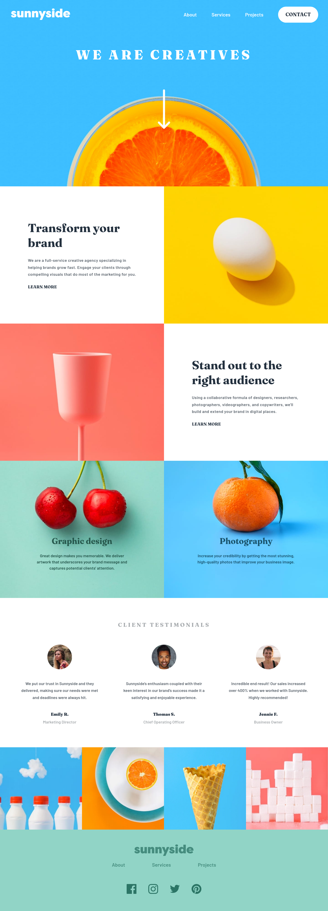

# Frontend Mentor - Time tracking dashboard solution

This is a solution to the [Time tracking dashboard challenge on Frontend Mentor](https://www.frontendmentor.io/challenges/time-tracking-dashboard-UIQ7167Jw). Frontend Mentor challenges help you improve your coding skills by building realistic projects. 

## Table of contents

- [Frontend Mentor - Time tracking dashboard solution](#frontend-mentor---time-tracking-dashboard-solution)
  - [Table of contents](#table-of-contents)
  - [Overview](#overview)
    - [The challenge](#the-challenge)
    - [Screenshot](#screenshot)
    - [Links](#links)
  - [My process](#my-process)
    - [Built with](#built-with)
    - [What I learned](#what-i-learned)
    - [Continued development](#continued-development)
  - [Author](#author)

**Note: Delete this note and update the table of contents based on what sections you keep.**

## Overview

### The challenge

Users should be able to:

- View the optimal layout for the site depending on their device's screen size
- See hover states for all interactive elements on the page
- Switch between viewing Daily, Weekly, and Monthly stats

### Screenshot

### Links

- Solution URL: [GitHub Repository](https://github.com/ikmrn/frontend-challenges/tree/sunnyside-landing)
- Live Site URL: [Live demo on Netlify](https://ikmrn-sunnyside-landing.netlify.app/)

## My process

### Built with

- Semantic HTML5 markup
- CSS custom properties
- Flexbox
- Grid

### What I learned

Throughout this project, I gained valuable insights into creating a responsive web page that maintains its aspect ratios across various screen resolutions, including 4K and 8K. By leveraging viewport units (vw and vh), I dynamically adjusted layout sizes, font sizes, and container dimensions to ensure adaptability to different screen sizes. This experience has deepened my understanding of responsive design principles and techniques.

Additionally, I had the opportunity to practice working with SVG sprites, manipulating dimensions, and colors. Integrating SVG sprites into the project allowed me to enhance scalability and optimize performance while maintaining crisp, high-quality graphics across devices. This hands-on experience further expanded my skill set and provided valuable insights into leveraging SVGs for web development.

### Continued development

Moving forward, I am keen on further enhancing my skills in creating more sophisticated layout containers and improving overall design aesthetics. I aim to explore advanced techniques and best practices in web development, such as CSS Grid and Flexbox, to achieve more flexible and efficient layouts.

## Author

- Frontend Mentor - [@ikmrn](https://www.frontendmentor.io/profile/ikmrn)
