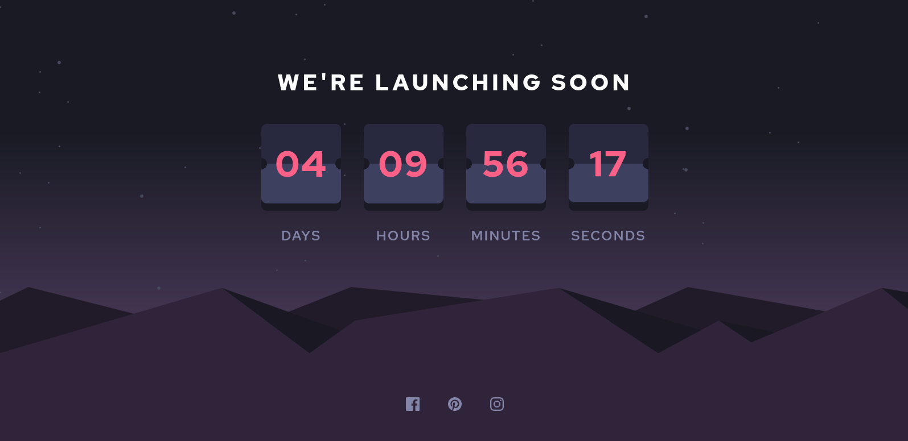

# Frontend Mentor - Product preview card component solution

This is a solution to the [Product preview card component challenge on Frontend Mentor](https://www.frontendmentor.io/challenges/product-preview-card-component-GO7UmttRfa). Frontend Mentor challenges help you improve your coding skills by building realistic projects.

## Table of contents

- [Frontend Mentor - Product preview card component solution](#frontend-mentor---product-preview-card-component-solution)
  - [Table of contents](#table-of-contents)
  - [Overview](#overview)
    - [The challenge](#the-challenge)
    - [Screenshot](#screenshot)
    - [Links](#links)
  - [My process](#my-process)
    - [Built with](#built-with)
    - [What I learned](#what-i-learned)
    - [Continued development](#continued-development)
  - [Author](#author)

**Note: Delete this note and update the table of contents based on what sections you keep.**

## Overview

### The challenge

- View the optimal layout depending on their device's screen size
- See hover and focus states for interactive elements

### Screenshot

### Links

- Solution URL: [GitHub Repository](https://github.com/ikmrn/frontend-challenges/tree/product-preview-card)
- Live Site URL: [Live demo on Netlify](https://ikmrn-product-preview-card.netlify.app/)

## My process

### Built with

- Semantic HTML5 markup
- CSS custom properties
- Flexbox

### What I learned

During this project, I practiced media queries extensively to ensure the responsiveness and adaptability of the layout across different devices and screen sizes. This included experimenting with various breakpoints and CSS techniques to create a seamless user experience on both desktop and mobile devices.

### Continued development

In future projects, I aim to deepen my understanding of advanced CSS techniques and explore more sophisticated media query strategies to handle complex layout requirements effectively. Additionally, I plan to delve into CSS frameworks like Bootstrap and Tailwind CSS to streamline my development process and leverage their extensive component libraries.

## Author

- Frontend Mentor - [@ikmrn](https://www.frontendmentor.io/profile/ikmrn)
