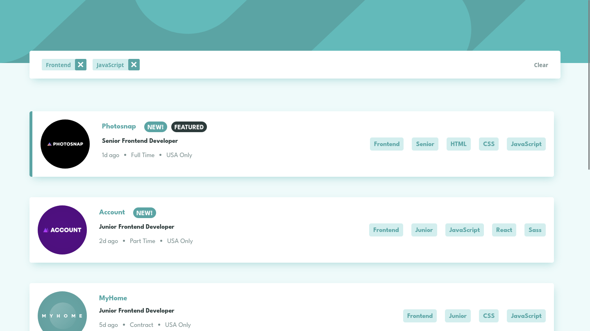

# Frontend Mentor - Newsletter sign-up form with success message solution

This is a solution to the [Newsletter sign-up form with success message challenge on Frontend Mentor](https://www.frontendmentor.io/challenges/newsletter-signup-form-with-success-message-3FC1AZbNrv). Frontend Mentor challenges help you improve your coding skills by building realistic projects.

## Table of contents

- [Frontend Mentor - Newsletter sign-up form with success message solution](#frontend-mentor---newsletter-sign-up-form-with-success-message-solution)
  - [Table of contents](#table-of-contents)
  - [Overview](#overview)
    - [The challenge](#the-challenge)
    - [Screenshot](#screenshot)
    - [Links](#links)
  - [My process](#my-process)
    - [Built with](#built-with)
    - [What I learned](#what-i-learned)
    - [Continued development](#continued-development)
  - [Author](#author)

## Overview

### The challenge

- Add their email and submit the form
- See a success message with their email after successfully submitting the form
- See form validation messages if:
  - The field is left empty
  - The email address is not formatted correctly
- View the optimal layout for the interface depending on their device's screen size
- See hover and focus states for all interactive elements on the page

### Screenshot

### Links

- Solution URL: [GitHub Repository](https://github.com/ikmrn/frontend-challenges/tree/newsletter-sign-up)
- Live Site URL: [Live demo on Netlify](https://ikmrn-newsletter-sign-up.netlify.app/)

## My process

### Built with

- Flexbox
- Grid
- Tailwind

### What I learned

My recent foray into Tailwind CSS has been truly enlightening. I found myself drawn to its simplicity and user-friendly nature. However, my inaugural Tailwind project proved to be more time-consuming than I initially anticipated. Despite this challenge, I was captivated by its intuitive functionality.

One aspect of Tailwind that particularly stood out to me was its approach to styling. While incredibly efficient, the abundance of classes within the HTML structure initially felt overwhelming. Admittedly, the sheer volume of classes can appear excessive. However, the minimal need for custom class naming was a significant advantage, simplifying the development process considerably.

In summary, while there were moments of difficulty, my overall experience with Tailwind CSS was positive. Its combination of simplicity and efficiency offers a promising path for future projects.

### Continued development

Moving forward, I am eager to delve deeper into the learning Tailwind CSS. The initial encounter with this framework has ignited a desire within me to expand my knowledge and skills in its usage. I am motivated to uncover more of its intricacies, explore advanced features, and master efficient workflows.

## Author

- Frontend Mentor - [@ikmrn](https://www.frontendmentor.io/profile/ikmrn)
